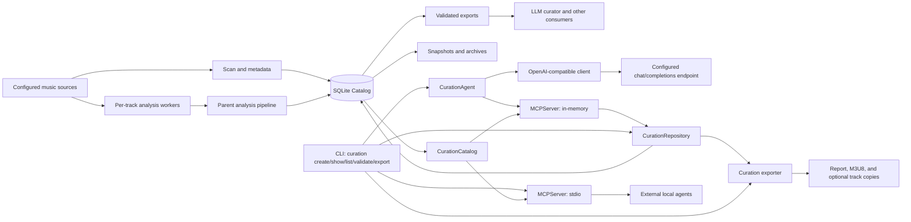

# Architecture

This document describes the current DJ Digger runtime and data model. It is a
technical implementation guide, not a historical plan or acceptance record.

## System boundaries

DJ Digger is a local-first command-line application. Configured music sources are
read-only inputs. The SQLite catalog is the durable application state, while exports,
snapshots, archives, and curated set files are publications that can be regenerated
from their authoritative inputs.



The main implementation layers are:

| Layer | Location | Responsibility |
| --- | --- | --- |
| CLI | `src/dj_digger/cli.py` | Typer commands, structured JSON diagnostics, progress, and exit codes. |
| Application | `src/dj_digger/application.py` | Owns the command-scoped database connection and coordinates workflows. |
| Configuration | `src/dj_digger/config.py` | Validates workspace, source, and DSP configuration. |
| Scan and metadata | `src/dj_digger/scanning/`, `src/dj_digger/metadata/` | Observes files, reconciles presence, and normalizes ExifTool metadata. |
| Catalog | `src/dj_digger/catalog/` | SQLite lifecycle, migrations, repositories, history, and read projections. |
| Analysis | `src/dj_digger/analysis/` | Eligibility, isolated extraction, append-only persistence, and analysis exports. |
| Publication | `src/dj_digger/exports/` | Schema validation, atomic export replacement, and snapshots. |
| Curation read model | `src/dj_digger/curation/` | Exposes bounded, globally deduplicated current-catalog candidates. |
| MCP | `src/dj_digger/mcp_server.py` | Publishes the curation read model in-process and over local stdio. |
| Native curation agent | `src/dj_digger/curation/agent.py` | Runs the bounded model/tool loop and accepts only a grounded persisted draft. |
| OpenAI-compatible client | `src/dj_digger/curation/client.py` | Calls the configured `/chat/completions` endpoint with bounded requests and sanitized failures. |
| Curation repository | `src/dj_digger/curation/repository.py` | Persists ordered drafts and the one-way human-validation transition. |
| Curation exporter | `src/dj_digger/exports/curation.py` | Atomically publishes reports, playlists, and optional portable track copies. |
| Curation skill | `skills/electronic-dj-set-curator/` | Consumes published evidence without accessing SQLite or source files. |

`WorkspaceApplication` is the orchestration boundary used by catalog commands. It
opens and migrates the database, registers configured sources in one transaction,
dispatches the requested service, and closes the connection even when the command
fails.

The standalone `copy` command is intentionally outside that boundary. It receives a
library root, playlist or explicit tracks, and output directory directly; it neither
loads workspace configuration nor opens SQLite. It publishes a safely renumbered
playlist, copied tracks, and manifest without modifying the source library.

## Catalog data model

The current catalog separates canonical facts and history from optimized read
projections, and includes normalized curation creations, ordered track membership,
and lifecycle constraints.

### Canonical state and history

- `library_sources` stores configured roots and source policy (`enabled`, `analyze`,
  and `set_eligible`).
- `tracks`, `directories`, and `library_artifacts` store current presence and the scan
  that last observed each item. Track identity is `(source_id, relative_path)`.
- `embedded_metadata` and `technical_audio_metadata` store the current normalized and
  probed facts for a track.
- `scan_runs` preserves scan lifecycle and counters. A partial unique index permits at
  most one `running` scan per source.
- `analysis_runs` stores aggregate run identity and counters. `audio_analysis` is an
  append-only attempt history; successful and failed attempts are not overwritten.
  `track_sections` belongs to an analysis attempt, and `track_events` records scan,
  metadata, and analysis events.
- An analysis identity consists of the analysis schema version, analyzer version, and
  DSP configuration hash. Reuse also requires unchanged input size and nanosecond
  modification time.

Foreign keys preserve source, run, track, analysis, section, and event relationships.
Successful scan reconciliation changes absence only after the complete observation
has been stored; a failed scan is recorded without marking previously known files
missing.

### Current projection and public view

`current_track_analysis` is a materialized, rebuildable projection of the newest
successful `audio_analysis` row for each track. It holds the analysis identity and the
small set of scalar facts needed by common reads. `AnalysisPersistence` advances it
in the same transaction that appends a successful attempt, its sections, event, and
run counter. A failed attempt remains in history but never replaces this successful
projection.

`library_tracks` is a regular SQLite view. It filters to present tracks and joins the
source policy, current metadata, technical metadata, and `current_track_analysis`.
`LibraryReadRepository` is the read-only application boundary for that view: it uses
track-ID keyset pagination for listings and a stable source/path/track order for the
track export.

This distinction is intentional:

- the canonical tables and append-only history are durable facts;
- `current_track_analysis` is derived data and can be rebuilt deterministically;
- `library_tracks` contains no stored rows and is recreated by the schema;
- exports and snapshots are external publications, not primary storage.

The analysis export has a different public contract from the successful projection:
it publishes the newest attempt for each present track, including a failed newest
attempt when applicable, so consumers can see current uncertainty. Its three facets
are read from one SQLite snapshot and validated before any of them is replaced.

## Catalog migration lifecycle

`src/dj_digger/catalog/migrations.py` registers every catalog transition with
`sqlite_utils.Migrations`. It supports exactly these paths:

- an empty, unversioned database is initialized from the current packaged schema;
- supported existing catalogs are adopted into the migration ledger and upgraded
  through their ordered packaged migrations;
- unsupported legacy catalogs, unversioned non-empty databases, and catalogs newer
  than the application are rejected rather than guessed at or partially upgraded.

The migration registry records applied steps in `_sqlite_migrations`; migration
functions remain ordered, deterministic adapters around packaged SQL resources. This
ledger is the sole mechanism for all future catalog migrations. `user_version` remains
the application compatibility boundary so older catalogs can be adopted safely and
unsupported catalogs can be rejected before sqlite-utils mutates them.

Migration identifiers are monotonic UTC timestamps such as
`dj_digger_20260827105404`; the packaged SQL resource uses the same timestamp. The
identifier describes when the migration was introduced, not a catalog release number.

Each schema-changing step runs under `BEGIN IMMEDIATE`, verifies its expected starting
version, runs `foreign_key_check`, sets `user_version` only after validation, and rolls
back the complete schema change on error. Legacy migrations preserve existing tables
and history, add targeted indexes, create and backfill
`current_track_analysis`, and creates `library_tracks`.

The packaged SQL files are runtime resources. A wheel does not depend on the source
checkout to initialize or upgrade a catalog.

## SQLite lifecycle, transactions, and concurrency

`Database.open()` creates a file-backed SQLite connection with a five-second connect
timeout. Every opened connection configures:

- `journal_mode = WAL` for the database file;
- `foreign_keys = ON`;
- `synchronous = NORMAL`;
- `busy_timeout = 5000` milliseconds.

Repositories share the application-owned connection for a command. Mutation groups
use `Database.transaction()`, which commits as a unit and rolls back on any exception.
Exports that require a consistent multi-query view use `read_transaction()` and end
the read snapshot with a rollback. Migrations use their stricter immediate
transaction described above.

### sqlite-utils usage policy

The project deliberately uses the narrow sqlite-utils surfaces that reinforce the
catalog boundary:

- `Migrations` owns migration ordering and its applied-migration ledger;
- the `sqlite-utils` CLI is useful during development for read-only schema inspection
  (`tables`, `schema`, and `indexes`) and for exporting ad-hoc JSON/CSV diagnostics;
- `Database` table introspection can simplify future maintenance checks where it
  replaces hand-written `sqlite_master` queries without changing behavior.

Automatic table creation, inferred column types, direct CLI writes, and high-level
row mutation helpers are not used in production. They would bypass packaged SQL,
explicit constraints, repository transactions, and the append-only fact model.
Schema transformation helpers such as `transform()` are appropriate only while
authoring a migration: their emitted SQL must be reviewed and committed as a packaged,
deterministic migration before runtime use. The existing `sqlite3` connection remains
the shared runtime connection so WAL, foreign keys, busy timeout, `BEGIN IMMEDIATE`,
and repository transaction semantics stay under application control.

WAL allows independent reader connections to keep reading their pre-write snapshot
during a bounded write. It does not turn SQLite into a multi-writer service: competing
writers still serialize and wait up to the configured timeout. The analysis pipeline
also takes a non-blocking, file-backed advisory lock named `analysis-pipeline`, so a
second analysis command fails immediately instead of creating duplicate active work.

## Processing flows

### Scan and metadata

For each selected source, `ScanLifecycle` creates a running scan, stores positive
observations atomically, and reconciles missing tracks, directories, and artifacts
only when the scan succeeds. Discovery, restoration, file-fact changes, and missing
transitions append track events. The last successful scan remains the source
freshness boundary.

`MetadataService` selects present tracks whose input facts, extractor version, or
normalization version require work. ExifTool reads bounded batches and returns JSON;
DJ Digger normalizes only its owned fields. Metadata upserts and success/failure
events are persisted transactionally. Source files are never modified.

### Isolated audio analysis

`AnalysisPipeline` selects enabled, analysis-enabled, present tracks. Unless forced,
it excludes tracks with a reusable successful attempt for the same input facts and
analysis identity. A bounded parent-side thread pool schedules at most `--workers`
tracks concurrently.

Each scheduled track runs in a fresh `python -m dj_digger.analysis.worker` child
process. The child receives a versioned JSON request, reads and analyzes one audio
file, and returns bounded versioned JSON. It never opens the catalog. Timeouts kill
the worker process group, including its decoder subprocesses.

The parent validates worker output and is the only analysis component that writes
SQLite. Each outcome is committed independently, together with its history details,
event, aggregate counter, and successful projection update. A process interruption
therefore leaves completed tracks reusable. Before a later run starts, abandoned
`running` analysis runs are finalized from their already committed attempts.

The DSP implementation keeps decoded samples in `float32` and accumulates spectral
facts per FFT frame. These memory controls are separate from the SQLite read
optimizations.

### Refresh, exports, and snapshots

`refresh` runs scan, metadata, analysis, and export in order. A failed set-eligible
source prevents publication; other source or track-local failures may yield a partial
result with explicit diagnostics.

Publication boundaries are schema-validated and use staged files plus atomic
replacement:

- `tracks.tsv` is the current present-track projection and is the authority for
  availability and `set_eligible`;
- `library-artifacts.tsv` publishes current non-audio library artifacts;
- `dj-analysis.tsv`, `dj-sections.jsonl`, and `dj-analysis-run.json` are one analysis
  publication group and must be consumed together;
- `snapshot` creates `tracks.tsv`, `library-artifacts.tsv`, and a validated manifest
  with hashes in a new directory, with an optional deterministic `.tar.gz` archive.

Snapshots do not currently package the three analysis facets. Consumers that need
analysis must take the analysis publication group from one export run.

The electronic DJ set curator is downstream of these contracts. It joins track and
analysis facts by `(source_id, track_id, path)`, admits only present eligible tracks,
and emits validated JSON, M3U8, and Markdown artifacts. It neither writes the catalog
nor modifies the music library.

The implemented native curation path starts at `dj-digger curation create`. The CLI
loads configuration and invokes `CurationAgent`, which sends the conversation and
OpenAI function definitions to an OpenAI-compatible client. The agent executes the
same MCP server factory in memory: catalog tools read authoritative candidates and
`create_curation` is the sole write tool, normalizing selected references into a
persisted `draft` through `CurationRepository`. The model never receives SQLite,
source roots, absolute paths, or direct filesystem access. The separate `mcp` CLI
command exposes this tool boundary to external local agents over stdio.

Human review remains outside the model loop. A reviewer inspects the persisted order
and report with `curation show`, then explicitly advances the immutable record from
`draft` to `validated` with `curation validate`. The curation exporter reads either
status from the repository and atomically emits the requested report or playlist;
multi-source playlists require portable copied files. See
[Native curation](curation.md) for the trust, failure, and operational contracts.

## Diagnostics and maintenance

`doctor` validates source roots and required binaries, then reports migration state,
SQLite version, WAL mode, foreign-key status, synchronization and timeout settings,
database/WAL sizes, page statistics, and `quick_check`.

The explicit maintenance commands are:

```bash
dj-digger database optimize --config config/local.toml
dj-digger database quick-check --config config/local.toml
dj-digger database integrity-check --config config/local.toml
dj-digger database rebuild-current-analysis --config config/local.toml
```

`optimize` lets SQLite refresh planner statistics when useful. `quick-check` is the
bounded routine health check; `integrity-check` is the explicit full check.
`rebuild-current-analysis` deletes and recreates only the derived successful-analysis
projection in one transaction, then runs `PRAGMA optimize`. None of these commands
rewrites source music.

## Invariants for future changes

Changes must preserve these boundaries:

1. Source media remains read-only; catalog identity stays source-aware.
2. Failed scans do not reconcile absence, and analysis attempts remain append-only.
3. The parent owns SQLite during analysis; workers communicate only through the
   versioned, bounded JSON protocol.
4. A successful analysis attempt and its current projection advance atomically.
5. Derived state is rebuildable from canonical history; publications never become
   authoritative catalog storage.
6. Export identities, ordering, schemas, atomic groups, and partial-state reporting
   are public consumer contracts.
7. Every SQLite connection enables the required pragmas, and write transactions stay
   bounded enough for WAL readers and serialized writers.

Schema evolution is handled by ordered, transactional migrations and fresh-schema
initialization. Any new materialized projection needs an atomic write path, a
deterministic rebuild command or routine, query-plan coverage, and preservation tests.
Public view or export changes also require explicit schema/consumer compatibility
decisions rather than silent column or semantic changes.

# Mastering and DJ review

The catalog stores append-only FFmpeg EBU R128 attempts and rebuildable
current mastering and target-dependent DJ projections. `duplicates
--analyze --mastering` measures only present members of exact Chromaprint
groups; compatible successes are reused. `--list --dj-review` computes signed
deltas against the explicitly marked technical `best_quality` member and
returns only groups recommended for listening review. Missing measurements are
represented as null, and failed per-track attempts yield partial command
results. DJ targets default to -9 LUFS and -1 dBTP. No audio is modified and
no DJ candidate is selected.
