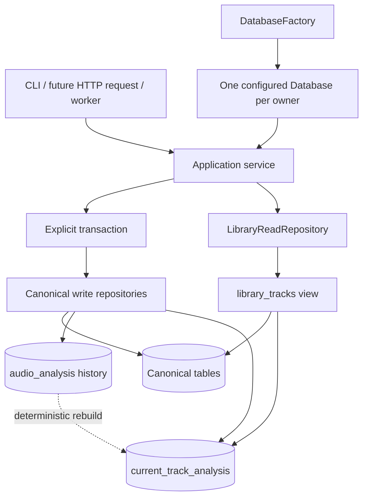

# DJ Digger Catalog V7 SQLite Scalability Implementation Plan

> **For agentic workers:** REQUIRED SUB-SKILL: Use superpowers:subagent-driven-development (recommended) or superpowers:executing-plans to implement this plan task-by-task. Steps use checkbox (`- [ ]`) syntax for tracking.

**Goal:** Establish a measured, upgrade-safe SQLite baseline for 100k+ tracks with explicit connection ownership, WAL concurrency, application-owned transactions, indexed critical queries, a rebuildable current-successful-analysis projection, stable read views, and operational diagnostics.

**Architecture:** Keep `audio_analysis` as append-only evidence and add `current_track_analysis` as a derived pointer plus typed browsing fields. Keep writes on canonical tables, expose common reads through `library_tracks`, and preserve current export semantics until the latest-attempt versus latest-success contract is explicitly changed. Upgrade existing V6 databases in place to V7 while retaining the fresh-install schema as the canonical full schema.

**Tech Stack:** Python 3.12, standard-library `sqlite3`, SQLite WAL/FTS-capable runtime, Typer, pytest, Ruff, mypy.

---

## Review decisions incorporated into this plan

1. **V7 must be a real upgrade.** `migrations.py` currently rejects every nonzero version except 6. V7 therefore needs both a packaged full `catalog-v7.sql` and a transactional `6 -> 7` migration, with preservation tests.
2. **“Current” has two different meanings today.** Reuse eligibility means “any successful attempt matching current input and analyzer identity”; analysis exports mean “latest attempt, even if failed.” `current_track_analysis` will mean latest successful attempt and will power browsing, not silently change analysis exports.
3. **The proposed projection columns do not match the current analysis contract.** The payload has `key`, `analysis_confidence`, `bpm_confidence`, `key_confidence`, `sub_energy`, `low_energy`, and `low_mid_energy`; it does not have generic `musical_key`, `confidence`, `mid_energy`, or `high_energy` fields.
4. **The event table also needs an index.** Existing analysis export/reconciliation queries filter `track_events` by `(analysis_run_id, event_type)`. At the proposed million-row scale, omitting that index leaves a known full scan.
5. **Source reconciliation indexes should be plan-tested, not assumed.** SQLite can use the proposed composite indexes for the equality prefix, but `last_seen_scan_id != ?` is not a selective range. Compare the full composite form with a smaller partial index before fixing the schema.
6. **WAL is not a write pool.** It permits readers alongside one writer. Each HTTP request/worker gets its own connection; no connection is shared across arbitrary threads or processes.
7. **V8 is a separate project.** FTS synchronization, job claiming, waveform artifacts, and persistent sets have separate invariants. Persistent-set behavior is not specified in the source proposal, so V8 requires its own design and implementation plan rather than invented tables in V7.



## Architecture decision records

### ADR-V7-1: Keep SQLite with one connection per owner

**Status:** Accepted for V7.

**Context:** The target is local-first, read-heavy, and has controlled writers. The existing standard-library boundary is sufficient, but its single long-lived CLI connection cannot become a global web connection.

**Decision:** Keep `sqlite3`, enable WAL, and create independent connections through `DatabaseFactory`. Do not add SQLAlchemy or a connection pool.

**Trade-off:** This keeps deployment and operations small, but preserves SQLite's single-writer limit. Revisit only after measured multi-writer or distributed-host requirements.

### ADR-V7-2: Upgrade V6 in place

**Status:** Accepted for V7.

**Context:** The current migration code rejects old versions, while long-lived history makes catalog recreation increasingly expensive.

**Decision:** Support exactly V6-to-V7 preservation plus fresh V7 initialization. Continue rejecting V1-to-V5 and unversioned nonempty databases.

**Trade-off:** The migration runner becomes more complex, but V7 no longer destroys or strands the first genuinely long-lived catalog.

### ADR-V7-3: Materialize latest success while preserving latest-attempt exports

**Status:** Accepted for V7.

**Context:** Browsing needs a current successful result; existing exports deliberately rank every attempt and can expose a newer failure.

**Decision:** `current_track_analysis` points to the latest successful attempt. Existing analysis export SQL retains latest-attempt semantics until a separately reviewed public-contract change.

**Trade-off:** Two explicit projections coexist, but neither silently changes meaning and both remain testable.

### ADR-V7-4: Split V7 scalability from V8 web storage

**Status:** Accepted for planning.

**Context:** FTS, jobs, sets, and waveform artifacts have distinct consistency and lifecycle rules, and persistent set semantics are absent from the proposal.

**Decision:** Deliver the measured SQLite/core-read baseline in V7 and design V8 separately.

**Trade-off:** The original broad definition of done becomes two release gates, preventing unreviewed domain assumptions and reducing migration risk.

## Target file map

- `src/dj_digger/catalog/database.py`: connection configuration, context management, transaction API, optimize/check/diagnostic primitives.
- `src/dj_digger/catalog/factory.py`: path-bound `DatabaseFactory`.
- `src/dj_digger/catalog/migrations.py`: ordered incremental migration runner.
- `src/dj_digger/catalog/sql/catalog-v7.sql`: canonical fresh V7 schema.
- `src/dj_digger/catalog/sql/migrate-v6-to-v7.sql`: preservation-safe V6 upgrade.
- `src/dj_digger/catalog/current_analysis.py`: rebuild service for the materialized projection.
- `src/dj_digger/catalog/read_repositories.py`: view-backed read boundary.
- `src/dj_digger/catalog/repositories.py`: canonical write/query repositories without commit ownership.
- `src/dj_digger/analysis/persistence.py`: atomically advance the projection after successful persistence.
- `src/dj_digger/analysis/exporters.py`: retain latest-attempt export semantics; only remove duplicated relational joins where semantics stay identical.
- `src/dj_digger/application.py`: use-case transactions, rebuild/maintenance operations, diagnostics.
- `src/dj_digger/cli.py`: deterministic application closing and `database` maintenance commands.
- `tests/performance/`: deterministic dataset builder, benchmark cases, and plan inspection helpers.
- `tests/test_database.py`: runtime configuration and lifecycle tests.
- `tests/test_catalog_migrations.py`: fresh V7 and V6 preservation upgrade tests.
- `tests/test_query_plans.py`: robust index-use regression tests.
- `tests/test_current_analysis.py`: projection advancement/rebuild semantics.
- `tests/test_read_repositories.py`: view contract tests.
- `tests/test_database_commands.py`: optimize/check/diagnostic CLI tests.
- `tests/test_sqlite_concurrency.py`: multi-connection WAL qualification.
- `schemas/catalog-v7.sql`: checkout copy kept byte-identical to the packaged full schema.

### Task 1: Add deterministic benchmark and query-plan infrastructure

**Files:**
- Create: `tests/performance/__init__.py`
- Create: `tests/performance/fixtures.py`
- Create: `tests/performance/benchmark_queries.py`
- Create: `tests/performance/query_plans.py`
- Create: `tests/performance/README.md`
- Test: `tests/test_performance_fixtures.py`

- [ ] **Step 1: Write a failing deterministic-fixture test**

```python
def test_build_catalog_has_requested_cardinality(tmp_path: Path) -> None:
    path = build_catalog(tmp_path / "catalog.sqlite", tracks=10, analyses_per_track=5)
    connection = sqlite3.connect(path)
    assert connection.execute("SELECT count(*) FROM tracks").fetchone()[0] == 10
    assert connection.execute("SELECT count(*) FROM audio_analysis").fetchone()[0] == 50
    assert connection.execute("SELECT count(*) FROM track_events").fetchone()[0] == 100
```

- [ ] **Step 2: Run the test and verify the missing module failure**

Run: `pytest tests/test_performance_fixtures.py -q`

Expected: FAIL because `tests.performance.fixtures` does not exist.

- [ ] **Step 3: Implement bulk fixture creation without repository-loop overhead**

`build_catalog()` must migrate a fresh database, insert one source and scan run, then use `executemany()` in bounded chunks. IDs, paths, timestamps, statuses, config hashes, and payload JSON must be deterministic. Alternate historical failures and successes while ensuring the final successful row is known.

```python
SCENARIOS = ((10_000, 1), (50_000, 5), (100_000, 5), (250_000, 10))

def build_catalog(path: Path, *, tracks: int, analyses_per_track: int) -> Path:
    with Database.open(path) as database:
        database.migrate()
        with database.transaction():
            _insert_source_and_scan(database)
            _insert_tracks(database, tracks)
            _insert_analysis_history(database, tracks, analyses_per_track)
            _insert_events(database, tracks * 2)
    return path
```

- [ ] **Step 4: Define named benchmark cases for existing V6/V7 operations**

Include database open, status counts, scan reconciliation selection/update, metadata eligibility, analysis eligibility, analysis history, track export, analysis export selection, latest analysis run, library listing, and pagination. Do not baseline FTS or persistent jobs before those features exist.

- [ ] **Step 5: Add normalized plan inspection**

```python
def explain(database: Database, sql: str, parameters: tuple[object, ...] = ()) -> list[str]:
    return [str(row[3]) for row in database.execute(f"EXPLAIN QUERY PLAN {sql}", parameters)]

def has_full_scan(details: list[str], table: str) -> bool:
    return any(detail.startswith(f"SCAN {table}") for detail in details)
```

Keep timing output local; CI assertions target semantics and query plans.

- [ ] **Step 6: Verify and commit the harness**

Run: `pytest tests/test_performance_fixtures.py -q`

Expected: PASS.

```bash
git add tests/performance tests/test_performance_fixtures.py
git commit -m "test: add catalog performance fixtures"
```

### Task 2: Centralize SQLite configuration and connection lifecycle

**Files:**
- Modify: `src/dj_digger/catalog/database.py`
- Create: `src/dj_digger/catalog/factory.py`
- Create: `tests/test_database.py`

- [ ] **Step 1: Write failing configuration and close tests**

Assert on a file-backed database that `journal_mode` is `wal`, `foreign_keys` is `1`, `synchronous` is `1` (`NORMAL`), and `busy_timeout` is `5000`. Assert use after context exit raises `sqlite3.ProgrammingError`.

```python
with Database.open(path) as database:
    assert database.scalar("PRAGMA journal_mode") == "wal"
    assert database.scalar("PRAGMA foreign_keys") == 1
    assert database.scalar("PRAGMA synchronous") == 1
    assert database.scalar("PRAGMA busy_timeout") == 5000
with pytest.raises(sqlite3.ProgrammingError):
    database.scalar("SELECT 1")
```

- [ ] **Step 2: Implement configuration, close, and context management**

```python
@classmethod
def open(cls, path: Path) -> Self:
    path.parent.mkdir(parents=True, exist_ok=True)
    connection = sqlite3.connect(path, timeout=5.0)
    cls._configure_database(connection)
    cls._configure_connection(connection)
    return cls(connection)

@staticmethod
def _configure_database(connection: sqlite3.Connection) -> None:
    mode = connection.execute("PRAGMA journal_mode = WAL").fetchone()[0]
    if str(mode).lower() != "wal":
        connection.close()
        raise RuntimeError(f"SQLite refused WAL mode: {mode}")

@staticmethod
def _configure_connection(connection: sqlite3.Connection) -> None:
    connection.execute("PRAGMA foreign_keys = ON")
    connection.execute("PRAGMA synchronous = NORMAL")
    connection.execute("PRAGMA busy_timeout = 5000")
```

Add `close()`, `__enter__() -> Self`, and `__exit__()`; preserve `read_transaction()` behavior.

- [ ] **Step 3: Add the path-bound factory**

```python
class DatabaseFactory:
    def __init__(self, path: Path) -> None:
        self._path = path

    def open(self) -> Database:
        return Database.open(self._path)
```

- [ ] **Step 4: Test independent connections and rollback on exception**

Open two factory connections and assert they are separately usable. In a failed `transaction()`, verify writes are absent from the second connection.

- [ ] **Step 5: Verify and commit**

Run: `pytest tests/test_database.py -q`

Expected: PASS.

```bash
git add src/dj_digger/catalog/database.py src/dj_digger/catalog/factory.py tests/test_database.py
git commit -m "feat: configure and close SQLite connections"
```

### Task 3: Make application services own all write transactions

**Files:**
- Modify: `src/dj_digger/catalog/repositories.py`
- Modify: `src/dj_digger/application.py`
- Modify: `src/dj_digger/metadata/exiftool.py`
- Modify: `src/dj_digger/cli.py`
- Test: `tests/test_application_contracts.py`
- Test: `tests/test_exiftool.py`
- Test: `tests/test_cli.py`

- [ ] **Step 1: Add observable rollback tests**

For source synchronization, raise on the second configured source and assert neither source persists. For track insertion and technical metadata, call within `database.transaction()` and verify rollback removes the row. Tests must assert database state, not only mock calls.

- [ ] **Step 2: Remove only the four repository-owned commits**

Remove commits from:

```text
SourceRepository.upsert
SourceRepository.update_root
TrackRepository.insert
TechnicalAudioMetadataRepository.upsert
```

Keep `Database.commit()` temporarily for tests/direct maintenance until all call sites are migrated; repositories must no longer call it.

- [ ] **Step 3: Add caller-owned boundaries**

Wrap the configuration-source loop in one `WorkspaceApplication` transaction. Update direct production callers of `TrackRepository.insert()` and `TechnicalAudioMetadataRepository.upsert()` to own a transaction; do not add nested transactions inside repositories. `MetadataService.refresh()` already owns the embedded-metadata batch transaction and should remain unchanged except where technical metadata becomes part of that use case.

- [ ] **Step 4: Close the CLI-owned application deterministically**

```python
with WorkspaceApplication(config) as service:
    diagnostic = action(service)
```

Implement `WorkspaceApplication.__enter__`, `__exit__`, and `close()` by delegating to its database. Do not close injected databases inside repositories.

- [ ] **Step 5: Verify no repository finalizes transactions**

Run: `rg -n "_database\.commit" src/dj_digger/catalog/repositories.py`

Expected: no matches.

Run: `pytest tests/test_application_contracts.py tests/test_exiftool.py tests/test_cli.py -q`

Expected: PASS.

- [ ] **Step 6: Commit**

```bash
git add src/dj_digger/catalog/repositories.py src/dj_digger/application.py src/dj_digger/metadata/exiftool.py src/dj_digger/cli.py tests/test_application_contracts.py tests/test_exiftool.py tests/test_cli.py
git commit -m "refactor: move catalog transactions to services"
```

### Task 4: Introduce an upgrade-safe Catalog V7 migration framework

**Files:**
- Create: `src/dj_digger/catalog/sql/catalog-v7.sql`
- Create: `src/dj_digger/catalog/sql/migrate-v6-to-v7.sql`
- Create: `schemas/catalog-v7.sql`
- Modify: `src/dj_digger/catalog/migrations.py`
- Modify: `tests/test_catalog_migrations.py`
- Modify: `tests/test_strict_current_contracts.py`

- [ ] **Step 1: Write a V6 preservation test before changing the version**

Build a V6 fixture with a source, present track, successful and failed analyses, sections, and events. Reopen using current code and assert after migration that every original row and primary key remains, `PRAGMA foreign_key_check` is empty, and `user_version == 7`.

- [ ] **Step 2: Replace single-version initialization with an ordered runner**

```python
CURRENT_VERSION = 7
CURRENT_SCHEMA = "catalog-v7.sql"
MIGRATIONS = {6: "migrate-v6-to-v7.sql"}

while current < CURRENT_VERSION:
    filename = MIGRATIONS.get(current)
    if filename is None:
        raise RuntimeError(f"legacy catalog version {current} is unsupported; recreate the catalog")
    _run_migration(connection, current, current + 1, filename)
    current += 1
```

Each upgrade uses `BEGIN IMMEDIATE`, validates the expected starting `user_version`, executes one packaged script, runs `PRAGMA foreign_key_check`, sets the next version, and commits. Preserve the current rejection of V1–V5 and unversioned nonempty databases.

- [ ] **Step 3: Add the complete V7 schema in this single version bump**

Both SQL files must include the final indexes from Task 5, `current_track_analysis` from Task 6, and `library_tracks` from Task 7 before `CURRENT_VERSION` becomes 7. Do not add schema objects under an already-released `user_version`; any later DDL correction requires V8 or an additional pre-release migration version.

- [ ] **Step 4: Keep fresh and upgraded schemas equivalent**

Create a fresh V7 database and an upgraded V6 database; compare normalized `sqlite_master` entries for application tables, indexes, and views. Continue the byte-equality test between `schemas/catalog-v7.sql` and the packaged SQL.

- [ ] **Step 5: Verify wheel packaging**

Run: `pytest tests/test_catalog_migrations.py tests/test_strict_current_contracts.py -q`

Expected: PASS, including the isolated wheel migration test.

- [ ] **Step 6: Commit**

```bash
git add src/dj_digger/catalog/migrations.py src/dj_digger/catalog/sql/catalog-v7.sql src/dj_digger/catalog/sql/migrate-v6-to-v7.sql schemas/catalog-v7.sql tests/test_catalog_migrations.py tests/test_strict_current_contracts.py
git commit -m "feat: add upgrade-safe catalog v7 migration"
```

### Task 5: Add measured critical-query indexes and regression tests

**Files:**
- Verify: `src/dj_digger/catalog/sql/catalog-v7.sql`
- Verify: `src/dj_digger/catalog/sql/migrate-v6-to-v7.sql`
- Create: `tests/test_query_plans.py`
- Modify: `tests/performance/benchmark_queries.py`

- [ ] **Step 1: Add failing semantic query-plan tests**

Generate enough rows for SQLite to choose realistic plans, run `ANALYZE`, and assert critical queries contain `SEARCH ... USING INDEX` and do not contain `SCAN audio_analysis` or `SCAN track_events`. Match table/index tokens rather than full SQLite wording.

- [ ] **Step 2: Add the analysis and event indexes**

```sql
CREATE INDEX idx_audio_analysis_success_lookup
ON audio_analysis (
    track_id, input_size_bytes, input_mtime_ns,
    analysis_schema_version, analyzer_version, config_hash
)
WHERE analysis_status = 'succeeded';

CREATE INDEX idx_audio_analysis_run_status
ON audio_analysis (analysis_run_id, analysis_status);

CREATE INDEX idx_audio_analysis_track_history
ON audio_analysis (track_id, id DESC);

CREATE INDEX idx_track_events_analysis_run_type
ON track_events (analysis_run_id, event_type);
```

- [ ] **Step 3: Measure both reconciliation index shapes**

Compare the proposed full index:

```sql
ON tracks(source_id, presence_status, last_seen_scan_id)
```

with a partial candidate:

```sql
ON tracks(source_id, last_seen_scan_id) WHERE presence_status = 'present'
```

Repeat for `directories` and `library_artifacts`. Record plans and local timings at 10k, 100k, and 250k tracks. Choose one shape consistently and document the evidence in `tests/performance/README.md`; do not retain both.

- [ ] **Step 4: Validate existing unique indexes are not duplicated**

Assert no additional `(source_id, relative_path)` indexes are created because each table already has a UNIQUE constraint.

- [ ] **Step 5: Verify and commit**

Run: `pytest tests/test_query_plans.py -q`

Expected: PASS with targeted searches for analysis eligibility, run reconciliation, track history, event lookup, and three scan reconciliations.

```bash
git add tests/test_query_plans.py tests/performance
git commit -m "perf: index critical catalog queries"
```

### Task 6: Materialize latest successful analysis without changing export semantics

**Files:**
- Verify: `src/dj_digger/catalog/sql/catalog-v7.sql`
- Verify: `src/dj_digger/catalog/sql/migrate-v6-to-v7.sql`
- Create: `src/dj_digger/catalog/current_analysis.py`
- Modify: `src/dj_digger/analysis/persistence.py`
- Create: `tests/test_current_analysis.py`
- Modify: `tests/test_analysis_exporters.py`

- [ ] **Step 1: Write failing semantic tests**

Cover: first success creates the projection; a newer success replaces it; a newer failure leaves the last success current; cascade track deletion removes it; rebuild produces the same rows; and analysis export still publishes the newest attempt even when it failed.

- [ ] **Step 2: Add schema-aligned projection columns**

```sql
CREATE TABLE current_track_analysis (
    track_id INTEGER PRIMARY KEY REFERENCES tracks(id) ON DELETE CASCADE,
    audio_analysis_id INTEGER NOT NULL UNIQUE REFERENCES audio_analysis(id),
    analysis_schema_version INTEGER NOT NULL,
    analyzer_version TEXT NOT NULL,
    config_hash TEXT NOT NULL,
    analysis_confidence REAL NULL,
    bpm REAL NULL,
    bpm_confidence REAL NULL,
    beat_stability REAL NULL,
    musical_key TEXT NULL,
    key_confidence REAL NULL,
    sub_energy REAL NULL,
    low_energy REAL NULL,
    low_mid_energy REAL NULL,
    updated_at TEXT NOT NULL
);
```

The migration backfill chooses `MAX(id)` among `analysis_status='succeeded'` per track and extracts typed fields with `json_extract(payload_json, '$.bpm')`, `$.key`, and the matching payload keys. `analysis_confidence` comes from the dedicated column, not JSON.

- [ ] **Step 3: Implement one shared upsert used by persistence and rebuild**

```python
UPSERT_CURRENT = """
INSERT INTO current_track_analysis (...)
SELECT ... FROM audio_analysis WHERE id = ? AND analysis_status = 'succeeded'
ON CONFLICT(track_id) DO UPDATE SET ...
WHERE excluded.audio_analysis_id > current_track_analysis.audio_analysis_id
"""
```

Keep the upsert in the same `Database.transaction()` that inserts the successful attempt and sections. Failed attempts never call it.

- [ ] **Step 4: Implement deterministic rebuild**

`CurrentAnalysisProjector.rebuild()` deletes and repopulates the projection inside one transaction using the same SQL field mapping. It returns the rebuilt row count and is idempotent.

- [ ] **Step 5: Verify historical and public contracts**

Run: `pytest tests/test_current_analysis.py tests/test_analysis_persistence.py tests/test_analysis_exporters.py -q`

Expected: PASS; `audio_analysis` row count never decreases and latest-failed export behavior remains unchanged.

- [ ] **Step 6: Commit**

```bash
git add src/dj_digger/catalog/current_analysis.py src/dj_digger/analysis/persistence.py tests/test_current_analysis.py tests/test_analysis_exporters.py
git commit -m "feat: materialize current successful analysis"
```

### Task 7: Add the stable library read view and repository

**Files:**
- Verify: `src/dj_digger/catalog/sql/catalog-v7.sql`
- Verify: `src/dj_digger/catalog/sql/migrate-v6-to-v7.sql`
- Create: `src/dj_digger/catalog/read_repositories.py`
- Modify: `src/dj_digger/catalog/repositories.py`
- Modify: `src/dj_digger/exports/tracks.py`
- Create: `tests/test_read_repositories.py`
- Modify: `tests/test_tracks_export.py`

- [ ] **Step 1: Lock the existing `tracks.tsv` result contract with a failing view-parity test**

Insert present and missing tracks, null metadata, populated metadata, technical metadata, and current analysis. Assert a view-backed read returns one present row and preserves all existing track-export columns and ordering.

- [ ] **Step 2: Create `library_tracks` with actual V7 names**

Join `tracks`, `library_sources`, `embedded_metadata`, `technical_audio_metadata`, and `current_track_analysis`; filter `t.presence_status='present'`. Include existing export columns plus analysis identifiers and typed current-analysis fields. Keep `analysis_enabled` and `set_eligible` distinct.

- [ ] **Step 3: Introduce a read-only repository**

```python
class LibraryReadRepository:
    def list_tracks(self, *, limit: int, after_track_id: int | None = None) -> list[tuple[Any, ...]]:
        if limit < 1 or limit > 1000:
            raise ValueError("limit must be between 1 and 1000")
        ...
```

Use keyset pagination (`track_id > ? ORDER BY track_id LIMIT ?`) for the web-facing baseline. Keep stable source/path ordering as a separate export method because changing export order is a public-contract change.

- [ ] **Step 4: Refactor only semantically identical reads**

Move `TrackRepository.export_rows()` to `LibraryReadRepository.export_rows()` and update `TracksExporter`. Do not move write methods and do not make `AnalysisExporter` use the successful projection for its latest-attempt selection.

- [ ] **Step 5: Verify and commit**

Run: `pytest tests/test_read_repositories.py tests/test_tracks_export.py tests/test_analysis_exporters.py -q`

Expected: PASS with byte-identical track export fixtures.

```bash
git add src/dj_digger/catalog/read_repositories.py src/dj_digger/catalog/repositories.py src/dj_digger/exports/tracks.py tests/test_read_repositories.py tests/test_tracks_export.py
git commit -m "feat: expose catalog v7 library read view"
```

### Task 8: Add optimize, health diagnostics, and explicit database commands

**Files:**
- Modify: `src/dj_digger/catalog/database.py`
- Modify: `src/dj_digger/application.py`
- Modify: `src/dj_digger/cli.py`
- Create: `tests/test_database_commands.py`
- Modify: `tests/test_cli_status_doctor.py`

- [ ] **Step 1: Write failing observable command tests**

Assert `doctor` reports SQLite runtime/schema versions, WAL mode, foreign keys, synchronous level, busy timeout, database/WAL sizes, SHM presence, page count/size, freelist count, and `quick_check`. Assert `database quick-check`, `database integrity-check`, and `database optimize` return structured successful JSON.

- [ ] **Step 2: Add database primitives**

```python
def optimize(self) -> None:
    self.execute("PRAGMA optimize")

def quick_check(self) -> str:
    return str(self.scalar("PRAGMA quick_check"))

def integrity_check(self) -> list[str]:
    return [str(row[0]) for row in self.execute("PRAGMA integrity_check").fetchall()]
```

Resolve the main database path from `PRAGMA database_list`; use `Path.stat()` only after checking file existence. Report `-wal` and `-shm` state without forcing a checkpoint.

- [ ] **Step 3: Add a Typer database command group**

Commands are explicit and open/close their own application-scoped connection. Add `rebuild-current-analysis` here and run `optimize()` after that bulk rebuild. Do not automatically run `integrity_check` or `wal_checkpoint(TRUNCATE)`.

- [ ] **Step 4: Extend doctor without making transient WAL/SHM absence an error**

`quick_check != 'ok'`, disabled foreign keys, non-WAL mode, or wrong schema version are issues. WAL file size and SHM presence are informational.

- [ ] **Step 5: Verify and commit**

Run: `pytest tests/test_database_commands.py tests/test_cli_status_doctor.py tests/test_cli.py -q`

Expected: PASS.

```bash
git add src/dj_digger/catalog/database.py src/dj_digger/application.py src/dj_digger/cli.py tests/test_database_commands.py tests/test_cli_status_doctor.py tests/test_cli.py
git commit -m "feat: add SQLite maintenance diagnostics"
```

### Task 9: Qualify WAL concurrency with independent connections

**Files:**
- Create: `tests/test_sqlite_concurrency.py`
- Modify: `tests/performance/README.md`

- [ ] **Step 1: Test a reader during an uncommitted writer transaction**

Open and migrate before starting threads/processes. Use two independently opened databases, begin a writer transaction, insert a row, and hold it with `threading.Event`. Assert the reader completes a count query within a bounded test synchronization timeout and sees the pre-transaction snapshot.

- [ ] **Step 2: Test reader availability during bulk scan writes**

Write a bounded batch inside one connection while 5–10 reader threads repeatedly open, query, and close their own connections. Collect exceptions and assert no persistent `database is locked` errors. Avoid brittle microsecond thresholds.

- [ ] **Step 3: Test busy timeout behavior for competing writers**

Hold one short write transaction and verify a second writer waits and succeeds when released before 5 seconds. Separately verify a deliberately overlong lock raises `sqlite3.OperationalError`; keep this test isolated/marked slow if its runtime is unsuitable for normal CI.

- [ ] **Step 4: Verify and commit**

Run: `pytest tests/test_sqlite_concurrency.py -q`

Expected: PASS.

```bash
git add tests/test_sqlite_concurrency.py tests/performance/README.md
git commit -m "test: qualify SQLite WAL concurrency"
```

### Task 10: Requalify performance and release Catalog V7

**Files:**
- Modify: `tests/performance/README.md`
- Modify: `docs/acceptance/implementation-requalification.md`

- [ ] **Step 1: Run the same before/after benchmark cases**

Use 10k/50k/100k/250k tracks and 1/5/10 analyses per track. Record machine/runtime metadata, database size, row counts, median of repeated warm/cold runs, and normalized plans. The 100k/500k-analysis scenario is the release gate; 250k/2.5M is qualification evidence, not a CI fixture.

- [ ] **Step 2: Run query-plan regression tests in CI scope**

Run: `pytest tests/test_query_plans.py tests/test_current_analysis.py tests/test_read_repositories.py tests/test_sqlite_concurrency.py -q`

Expected: PASS with no critical historical-analysis or event full scans.

- [ ] **Step 3: Run full Python 3.12 quality gates**

Run:

```bash
uv run --python 3.12 pytest -q
uv run --python 3.12 ruff check src tests
uv run --python 3.12 mypy src
```

Expected: all tests pass, Ruff reports no errors, and mypy reports success.

- [ ] **Step 4: Run integrity and packaging gates**

Build the wheel, initialize a fresh V7 catalog from the installed wheel, upgrade a preserved V6 fixture, run `PRAGMA foreign_key_check`, `database quick-check`, and representative exports from both.

- [ ] **Step 5: Record acceptance evidence**

Document exact commands, dataset cardinalities, plans, results, and any pending manual concurrency checks. Do not claim 100k acceptance from small fake fixtures.

- [ ] **Step 6: Commit the evidence**

```bash
git add tests/performance/README.md docs/acceptance/implementation-requalification.md
git commit -m "docs: record catalog v7 requalification"
```

## Catalog V7 definition of done

- Fresh databases initialize as V7 and populated V6 databases upgrade without data loss.
- Every independently opened connection enables foreign keys, a 5-second busy timeout, and synchronous NORMAL; the database is in WAL mode.
- CLI-owned connections close deterministically; the factory creates independent connections.
- No repository calls `commit()`; service/use-case rollback tests assert observable state.
- Analysis eligibility, run reconciliation, history, event lookup, and scan reconciliation use the selected indexes at representative cardinalities.
- `audio_analysis` remains append-only.
- `current_track_analysis` represents the latest successful attempt, advances atomically, survives later failures, and rebuilds deterministically.
- `library_tracks` is a stable relational read contract; it is not described as a cache.
- Existing latest-attempt analysis exports and track-export bytes retain their tested semantics.
- Doctor and explicit database commands expose health without aggressive checkpointing.
- Concurrent readers remain available during the qualified single-writer workloads.
- The same benchmark cases provide before/after evidence at the 100k-track gate.

## Required V8 design follow-up

Create a separate reviewed design before implementation. It must resolve:

- FTS inclusion semantics for missing tracks and atomic synchronization across scan and metadata transactions;
- proven browser filter/sort combinations before adding UI indexes;
- job payload/result schemas, lease/recovery behavior, cancellation semantics, and atomic claim SQL;
- persistent set identity, ordering, revisions/history, source-track deletion behavior, and export contract;
- waveform binary format, atomic artifact publication, stale-version cleanup, and rebuild ownership;
- agent-facing query authorization, bounded result sizes, and whether read views become versioned public contracts.

Only after those decisions should V8 receive its own TDD implementation plan and release-specific definition of done.
